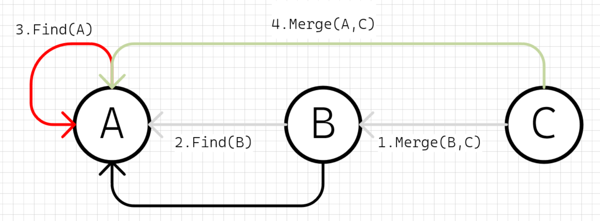

# 并查集
并查集（Disjoint Set）是一种树型的数据结构，用于处理一些不相交集合（Disjoint Sets）的合并及查询问题。常常在使用中以森林来表示。

并查集的主要操作如下：

1. makeSet(s)：建立一个新的并查集，其中包含s个单元素集合。
2. unionSet(x, y)：若x和y不在同一集合，则将x和y所在的集合合并为一个集合。
3. findSet(x)：查找元素x所在的集合，返回该集合的代表元素。

并查集的基本思想是维护一个由树组成的森林，其中每个节点都有一个父节点指针指向它的父节点。初始时，每个节点自成一个集合，即它们的父节点都指向自己。每次进行合并操作时，将两个集合的根节点连接起来，使其中一个根节点成为另一个根节点的子节点。这样，就可以通过检查某个节点的祖先，来确定它所属的集合。

并查集的主要优点是在合并和查询操作中具有较高的效率，时间复杂度均为O(log n)。并查集常用于解决图论中的连通性问题，如最小生成树、最大流等算法中。


# LeetCode 547. 省份数量
> 有 n 个城市，其中一些彼此相连，另一些没有相连。如果城市 a 与城市 b 直接相连，且城市 b 与城市 c 直接相连，那么城市 a 与城市 c 间接相连。
> 
> 省份 是一组直接或间接相连的城市，组内不含其他没有相连的城市。
> 
> 给你一个 n x n 的矩阵 isConnected ，其中 isConnected[i][j] = 1 表示第 i 个城市和第 j 个城市直接相连，而 isConnected[i][j] = 0 表示二者不直接相连。
> 
> 返回矩阵中 省份 的数量。


# 并差集题解
## 1. 初始化，确定各个城市省份关系之前，先假定每个城市都是一个省份，省份就是自己，差不多就是直辖市的感觉

```cpp
// MAX_CITY_N城市数量
int city[MAX_CITY_N];
void init() {
    // 用索引id代表城市，数组的值代表省份id
    for (int i=0; i<MAX_CITY_N; i++) {
        // 自己就是自己的省份，省份值即城市id
        city[i] = i;
    }
}
```


## 2. 基本合并算法，两个城市如果直接相连，则表示它们属于同一个省份，将其中一个的省份值设置为对方的省份值


```cpp
city[indexB] = city[indexA];
```
或者反过来（这里先以上面的为准）

```cpp
city[indexA] = city[indexB];
```

### 2.1 继续合并，假设B和C相连，将C的省份值设置为B的省份值

```cpp
city[indexC] = city[indexB];
```

实际上前面的操作之后，B的省份值是A的省份值

```cpp
city[indexC] = city[indexA];
```

## 3. 根省份与查找算法，前面合并之后B和C的省份都变成了A，而A的省份也是A，这里就可以将A确认为根省份了，这里就可以确认查找根省份的算法了：

```cpp
// 返回省份值，也是一个cityIndex
int find(int cityIndex) {
    // 假定从indexC开始查找，递归到indexA
    // city[indexA] == indexA，则indexA是indexC的省份
    if (city[cityIndex] == cityIndex) {
        return cityIndex;
    }
    // city[indexC] != indexC，所以需要继续find
    return find(city[cityIndex]);
}
```

## 4. 基于根省份的合并算法，将其中一个城市的根省份赋值给另一个城市的根省份

```cpp
void merge(int indexA, int indexB) {
    // 先查找A城市的根省份
    int rootProvinceOfA = find(indexA);
    // 然后将A城市的根省份作为B城市的新省份
    city[indexB] = rootProvinceOfA;
}
```
简化一下：
```cpp
void merge(int indexA, int indexB) {
    city[indexB] = find(indexA);
}
```

## 4.1 合并问题，如果出现下图的关系，按照上面的算法，会导致最终结算出两个根节点，而实际上它们都是联通的，只应该出现一个根节点，所以合并的时候需要先定位到根节点，让根节点去参与合并操作
* 根节点不准问题
```cpp
merge(A, B); // 连线AB，A为根
merge(A, D); // 连线AD，A为根
merge(C, D); // 连线CD，D的根变成了C，出现了AC两个根，但是它们实际都是联通的
```


* 所以合并算法需要考虑让两个节点的根节点相互联通，而不只是其中一个作为根参与联通


```cpp
void merge(int indexA, int indexB) {
    int rootOfA = find(indexA);
    int rootOfB = find(indexB);
    city[rootOfB] = rootOfA;
}
```

简化一下：
```cpp
void merge(int indexA, int indexB) {
    city[find(indexB)] = find(indexA);
}
```

## 4.2 合并成链问题，下面这种合并顺序下，搜索路径会变成一条长长的链条，搜索的时间复杂度退化成O(n)，这里可以考虑增加一个深度信息，合并的时候，让深度值高的根节点作为新的根
* 合并成链问题
```cpp
merge(C, D); // 连线CD，C为根
merge(B, C); // 连线BC，B为根
merge(A, B); // 连线AB，A为根
```


* 深度值高的作为新的根
```cpp
merge(C, D); // 连线CD，C为根
merge(B, C); // 连线BC，C深度为2，B深度为1，C作为新的根
merge(A, B); // 连线AB，B的根是C，所以这里是连接AC，C的深度当前为3，所以C继续作为新的根
```


* 新的初始化，带深度信息
```cpp
// MAX_CITY_N城市数量
int city[MAX_CITY_N];
int depth[MAX_CITY_N];
void init() {
    // 用索引id代表城市，数组的值代表省份id
    for (int i=0; i<MAX_CITY_N; i++) {
        // 自己就是自己的省份，省份值即城市id
        city[i] = i;
        depth[i] = 1;
    }
}
```

* 新的合并算法
```cpp
void merge(int indexA, int indexB) {
    int rootA = find(indexA);
    int rootB = find(indexB);
    if (depth[rootA] > depth[rootB]) {
        city[rootB] = city[rootA];
        ++depth[rootA];
    } else {
        city[rootA] = city[rootB];
        ++depth[rootB];
    }
}
```


## 5. 统计省份，只用统计根节点即可
```cpp
int count() {
    int counter = 0;
    for (int i = 0; i < city.size(); i++) {
        // 索引和当前的值相等即为根节点
        if (city[i] == i) {
            counter++;
        }
    }
    return counter;
}
```


## 6. 完整代码
```c++
#include <iostream>
#include <vector>
#include <set>
using namespace std;

class UnionFind {
public:
    UnionFind(int n) : depth(n, 1){
        city.reserve(n);
        for (int i = 0; i < n; i++) {
            city.push_back(i);
        }
    }

    int find(int cityIndex) const {
        if (city[cityIndex] == cityIndex) {
            return cityIndex;
        }
        return find(city[cityIndex]);
    }

    void merge(int indexA, int indexB) {
        int rootA = find(indexA);
        int rootB = find(indexB);
        if (depth[rootA] > depth[rootB]) {
            city[rootB] = city[rootA];
            ++depth[rootA];
        }
        else {
            city[rootA] = city[rootB];
            ++depth[rootB];
        }
    }

    int count() {
        int counter = 0;
        for (int i = 0; i < city.size(); i++) {
            if (city[i] == i) {
                counter++;
            }
        }
        return counter;
    }

private:
    vector<int> city;
    vector<int> depth;
};

class Solution {
public:
    static int findCircleNum(const vector<vector<int>>& isConnected) {
        UnionFind uf(isConnected.size());
        for (int i = 0; i < isConnected.size(); i++) {
            for (int j = 0; j < isConnected[i].size(); j++) {
                if (isConnected[i][j]) {
                    uf.merge(i, j);
                }
            }
        }
        return uf.count();
    }
};

void Test() {
    // 2
    vector<vector<int>> isConnected = {
        {1,1,0},
        {1,1,0},
        {0,0,1}};
    cout << Solution::findCircleNum(isConnected) << endl;

    // 3
    isConnected = {
        {1,0,0},
        {0,1,0},
        {0,0,1}};
    cout << Solution::findCircleNum(isConnected) << endl;

    // 3
    isConnected = {
        {1,1,0,0,0,0,0,1,0,0,0,0,0,0,0},
        {1,1,0,0,0,0,0,0,0,0,0,0,0,0,0},
        {0,0,1,0,0,0,0,0,0,0,0,0,0,0,0},
        {0,0,0,1,0,1,1,0,0,0,0,0,0,0,0},
        {0,0,0,0,1,0,0,0,0,1,1,0,0,0,0},
        {0,0,0,1,0,1,0,0,0,0,1,0,0,0,0},
        {0,0,0,1,0,0,1,0,1,0,0,0,0,1,0},
        {1,0,0,0,0,0,0,1,1,0,0,0,0,0,0},
        {0,0,0,0,0,0,1,1,1,0,0,0,0,1,0},
        {0,0,0,0,1,0,0,0,0,1,0,1,0,0,1},
        {0,0,0,0,1,1,0,0,0,0,1,1,0,0,0},
        {0,0,0,0,0,0,0,0,0,1,1,1,0,0,0},
        {0,0,0,0,0,0,0,0,0,0,0,0,1,0,0},
        {0,0,0,0,0,0,1,0,1,0,0,0,0,1,0},
        {0,0,0,0,0,0,0,0,0,1,0,0,0,0,1}};
    cout << Solution::findCircleNum(isConnected) << endl;
}
```


# 参考
[1] 并查集 Disjoint-set data structure https://en.wikipedia.org/wiki/Disjoint-set_data_structure

[2] LeetCode 547. 省份数量 https://leetcode.cn/problems/number-of-provinces/description/

[2] LeetCode 695. 岛屿的最大面积 https://leetcode.cn/problems/max-area-of-island/description/