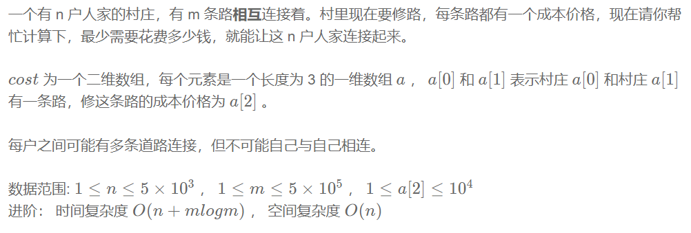
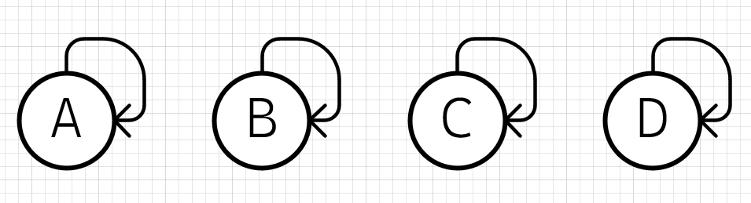
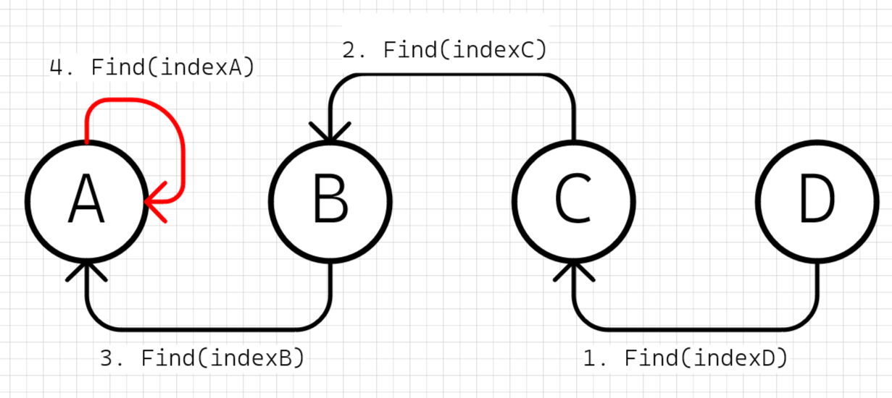
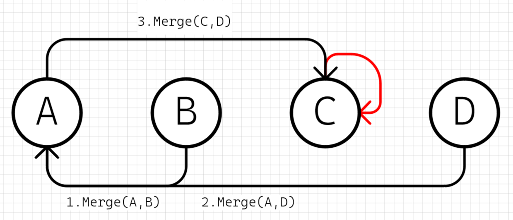
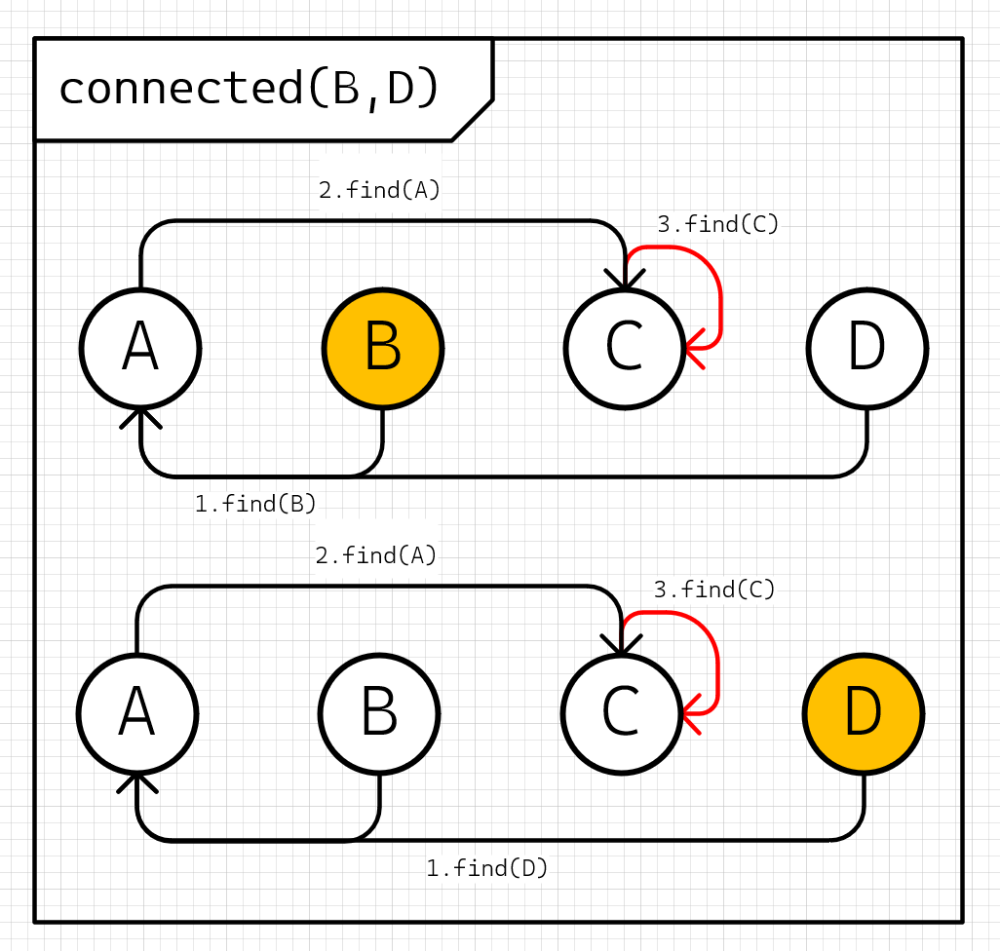
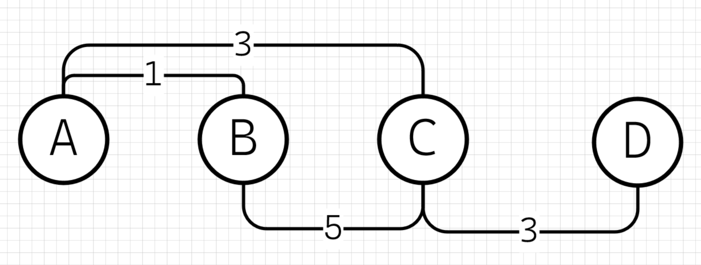
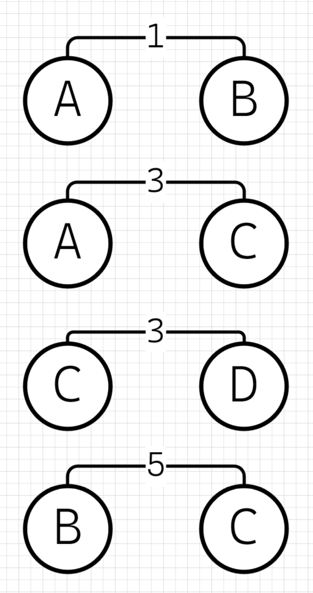
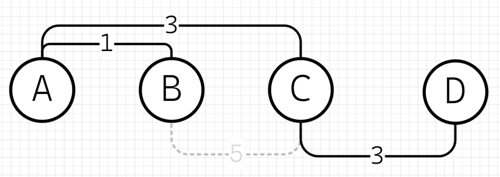

# Kruskal算法
Kruskal算法是一种常用的最小生成树算法，用于在给定无向连通图中找到最小生成树。最小生成树是一个连通子图，它包含了原图的所有顶点，并且具有最小的总权重或代价。

Kruskal算法的基本思想是从图中的边集合中逐步选择边，直到形成一个最小生成树。它的步骤如下：

1. 将图中的所有边按照权重进行排序。
2. 创建一个空的最小生成树集合。
3. 依次遍历排序后的边集合，选择权重最小的边。
4. 如果选择的边不会导致形成环路（即不会与已选择的边构成闭环），则将该边添加到最小生成树集合中。
5. 重复步骤4，直到最小生成树集合中包含了所有顶点（或边的数量达到了顶点数减1）。

Kruskal算法的关键在于判断边是否会导致形成环路。为了实现这一点，通常使用并查集数据结构来维护顶点之间的连接关系。

通过使用Kruskal算法，我们可以在一个连通图中找到一棵最小生成树，该树具有最小的总权重或代价。这在许多应用中都是有用的，如网络设计、电力传输、城市规划等。


# 最小生成树问题


# 题解
## 1. 特化的并差集问题，根据题目的要求，需要联通所有村庄，套用到并差集上相当于是所有节点都处于同一个集合中，只有一个根节点，这里根据Kruskal算法，一步一步构建出最优并差集解即可

### 1.1 并差集初始化，自己作为自己的根（为了方便理解，这里没有做查询优化）

```cpp
// MAX_NODE_N节点数量
int city[MAX_NODE_N];
void init() {
    for (int i=0; i<MAX_NODE_N; i++) {
        // 默认自己就是自己的根节点
        city[i] = i;
    }
}
```

### 1.2 并差集查找，递归查找根节点

```cpp
// 返回根节点索引
int find(int nodeIndex) {
    // 假定从indexC开始查找，递归到indexA
    // city[indexA] == indexA，则indexA是indexC的省份
    if (city[nodeIndex] == nodeIndex) {
        return nodeIndex;
    }
    // city[indexC] != indexC，所以需要继续find
    return find(city[nodeIndex]);
}
```

### 1.3 并差集合并，只有根节点参与合并
* 这里图示第三步中，会递归查找D的根节点A，最后是CA进行合并，C变成新的根节点（因为没有做优化，所以这里不是保持A作为根节点）

```cpp
void merge(int indexA, int indexB) {
    city[find(indexB)] = find(indexA);
}
```

### 1.4 并差集查询节点联通性，即判断两个节点是否存在相同的根节点

```cpp
bool connected(int indexA, int indexB) {
    return find(indexA) == find(indexB);
}
```

## 2. 应用Kruskal算法

### 2.1 边权排序，升序排列

```cpp
vector<vector<int>> cost;
std::sort(cost.begin(), cost.end(),
    [](const vector<int> &edgeX, const vector<int> &edgeY)->bool{
    return edgeX[2] < edgeY[2];
})
```

### 2.2 从最小边开始构建并差集，即最小生成树

```cpp
UnionFind uf(cost.size());
for(const auto &edge: cost) {
    // 为了避免形成环，需要判断两个节点是否已经联通
    if(!uf.connected(edge[0], edge[1])) {
        // 构建最小生成树
        uf.merge(edge[0], edge[1]);
    }
}
```

### 2.3 最小费用计算，前面构建最小生成树的过程中，将边权加起来即可
```cpp
int total_cost = 0;
for(const auto &edge: cost) {
    if(!uf.connected(edge[0], edge[1])) {
        // 构建最小生成树
        uf.merge(edge[0], edge[1]);
        // 计算最小费用
        total_cost += edge[2];
    }
}
```

## 3. 完整代码
```cpp

class UnionFind {
  public:
    UnionFind(int n) : depth(n, 1) {
        city.reserve(n);
        for (int i = 0; i < n; i++) {
            city.push_back(i);
        }
    }

    int find(int cityIndex) const {
        if (city[cityIndex] == cityIndex) {
            return cityIndex;
        }
        return find(city[cityIndex]);
    }

    void merge(int indexA, int indexB) {
        int rootA = find(indexA);
        int rootB = find(indexB);
        if (depth[rootA] > depth[rootB]) {
            city[rootB] = city[rootA];
            ++depth[rootA];
        } else {
            city[rootA] = city[rootB];
            ++depth[rootB];
        }
    }

    int count() {
        int counter = 0;
        for (int i = 0; i < city.size(); i++) {
            if (city[i] == i) {
                counter++;
            }
        }
        return counter;
    }

    bool connected(int indexA, int indexB) const {
        return find(indexA) == find(indexB);
    }

  private:
    vector<int> city;
    vector<int> depth;
};

class Kruskal {
  public:
    Kruskal(int nodeSize, vector<vector<int>>&& costData)
        : uf(nodeSize), cost(costData) {
        // 边权排序
        std::sort(cost.begin(), cost.end(),
        [](const vector<int>& edgeX, const vector<int>& edgeY)->bool {
            return edgeX[2] < edgeY[2];
        });

        // 构建最小生成树
        for (const auto& edge : cost) {
            // cost是一个二维数组，edge是长度为3的一维数组
            // 索引0和1存的两个相连的节点索引值，索引2存的连接两个节点的费用
            // 数据是从1开始的，并差集用的数据是从0开始的，所以这里要-1
            if (!uf.connected(edge[0] - 1, edge[1] - 1)) {
                uf.merge(edge[0] - 1, edge[1] - 1);
                total_cost += edge[2];
            }
        }
    }

    int MinCost() const {
        return total_cost;
    }
  private:
    vector<vector<int>> cost;
    UnionFind uf;
    int total_cost{0};
};

class Solution {
public:
    /**
     * 代码中的类名、方法名、参数名已经指定，请勿修改，直接返回方法规定的值即可
     *
     * 返回最小的花费代价使得这n户人家连接起来
     * @param n int整型 n户人家的村庄
     * @param m int整型 m条路
     * @param cost int整型vector<vector<>> 一维3个参数，表示连接1个村庄到另外1个村庄的花费的代价
     * @return int整型
     */
    int miniSpanningTree(int n, int m, vector<vector<int>>& cost) {
        // write code here
        Kruskal kal(n, std::move(cost));
        return kal.MinCost();
    }
};
```


# 参考
[1] Kruskal's algorithm https://en.wikipedia.org/wiki/Kruskal%27s_algorithm

[2] 并查集 Disjoint-set data structure https://en.wikipedia.org/wiki/Disjoint-set_data_structure

[3] LeetCode 1135. 最低成本联通所有城市 https://leetcode.cn/problems/connecting-cities-with-minimum-cost/description/

[4] LeetCode 1584. 连接所有点的最小费用 https://leetcode.cn/problems/min-cost-to-connect-all-points/description/

[5] 最小生成树 https://www.nowcoder.com/practice/735a34ff4672498b95660f43b7fcd628