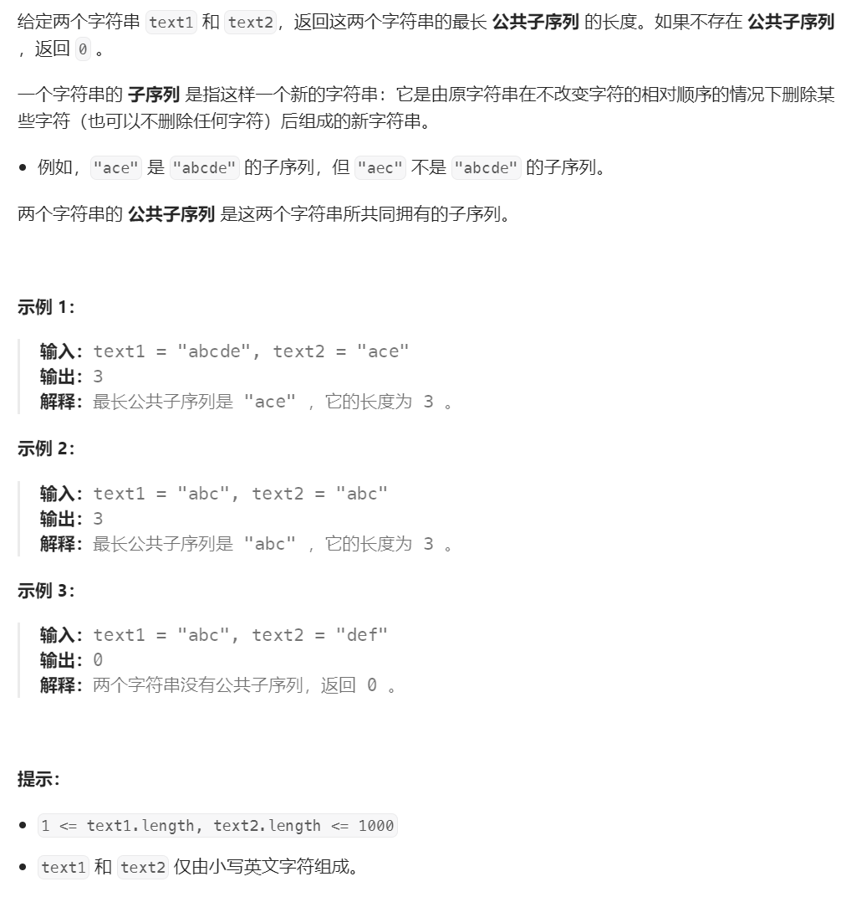
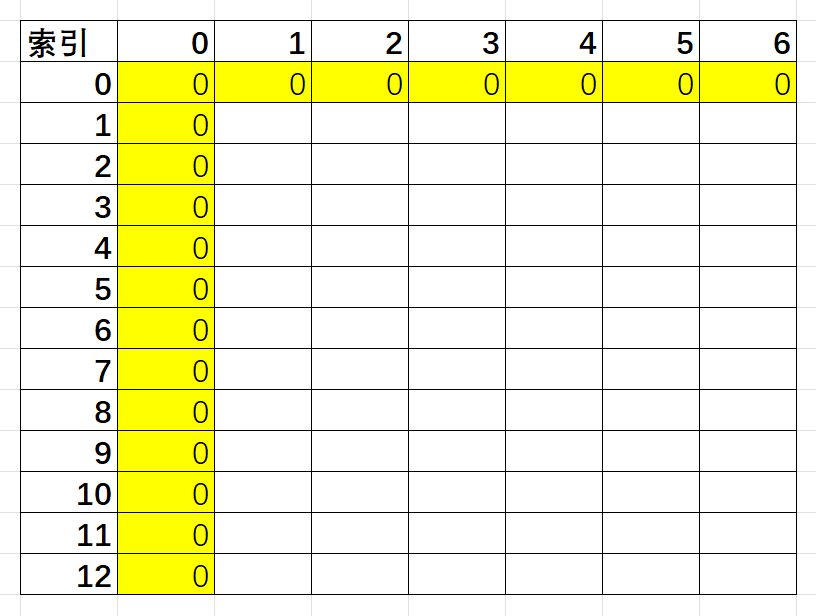
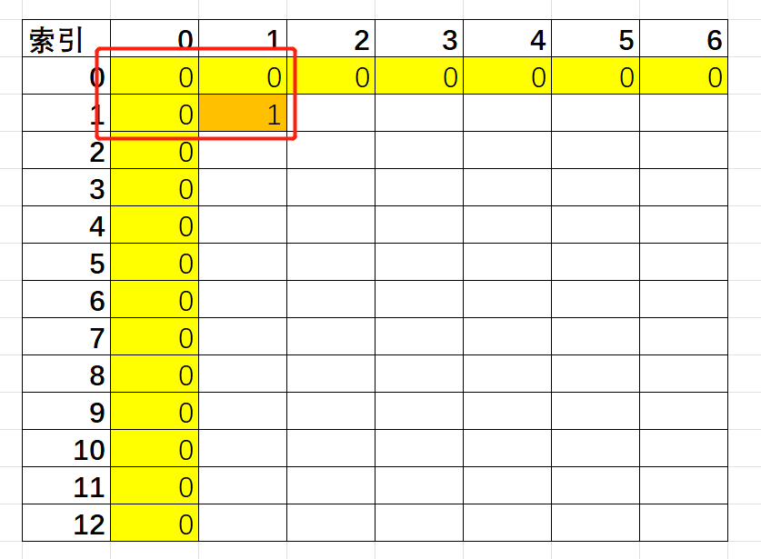
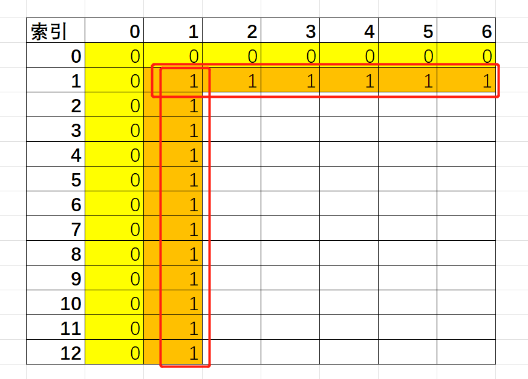
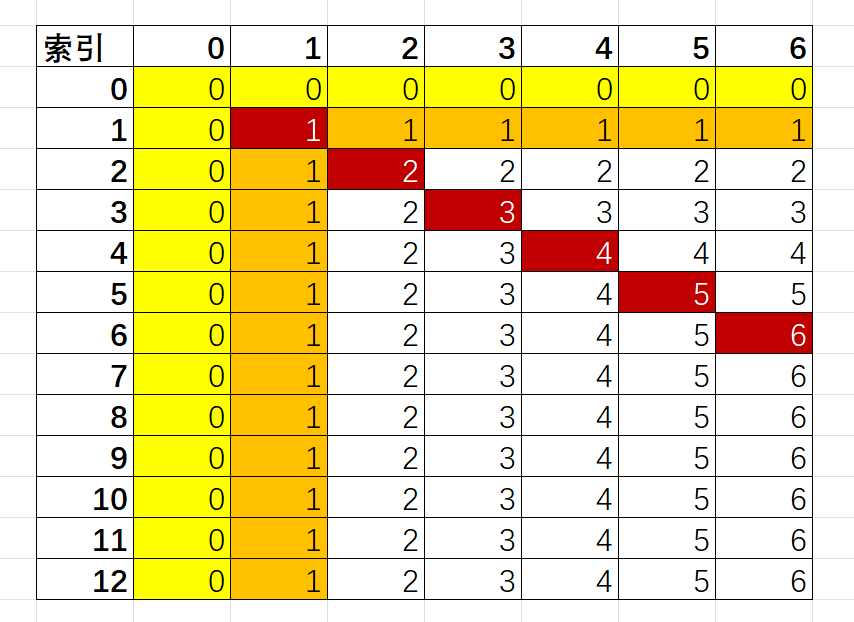
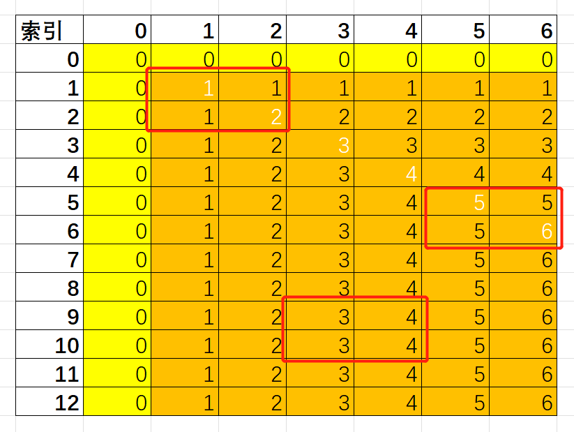
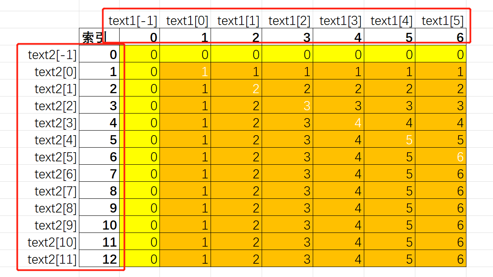

# LeetCode 1143. 最长公共子序列


# 题解
这题能动态规划出来我是想不到的，我这脑回路也就能想到排列组合，然后穷举了。直接看题解，发现答案非常简单（才不）

## 1. 确认状态转移方程（其中same(a,b)，当两个字符串的第a位和第b位完全相同时为1，否则为0）
$$
dp[i][j]=max\{dp[i-1][j-1]+same(i,j),dp[i-1][j],dp[i][j-1]\}
$$

## 2. 确定初始条件（索引从1开始）
$$
dp[1][1]=same(1,1)
$$

## 3. 理解状态转移方程
### 3.1 这里额外引入最小字符串为空的概念，避免计算$i-1$索引出现负值问题，当索引i或者j为0的时候，其中一个子串长度为0，所以这里可以将它们直接初始化为0值，即$dp[0][j] = 0$或者$dp[i][0] = 0$


### 3.2 而且更主要的是，当计算`dp[i][j]`时，有三个值是需要提前确认的，即`dp[i-1][j]`, `dp[i][j-1]`, `dp[i-1][j-1]`


### 3.3 不管是横向按索引递增遍历，还是纵向按索引递增遍历，都能满足提前确认这三个值的条件`dp[i-1][j]`, `dp[i][j-1]`, `dp[i-1][j-1]`



### 3.4 观察发现，$dp[i-1][j-1] + 1$始终是大于等于$dp[i-1][j]$和$dp[i][j-1]$，即$same(i, j) = 1$的时候。（我这里假定这俩字符串是`aaaaaa`和`aaaaaaaaaaaa`，你也可以用其它字符串带入验证）


### 3.5 另外，`dp[i][j-1]`或者`dp[i-1][j]`也始终大于等于`dp[i-1][j-1]`


### 3.6 状态转移方程套用
```cpp
int longestCommonSubsequence(string text1, string text2) {
    vector<vector<int>> dp(text1.size() + 1, vector<int>(text2.size() + 1));
    for (int i = 1; i <= text1.size(); i++) {
        for (int j = 1; j <= text2.size(); j++) {
            if (text1[i - 1] == text2[j - 1]) {
                dp[i][j] = dp[i - 1][j - 1] + 1;
            } else {
                dp[i][j] = std::max(dp[i - 1][j], dp[i][j - 1]);
            }
        }
    }
    return dp[text1.size()][text2.size()];
}
```

### 3.7 迭代索引问题，两个for循环都是从1开始的好理解，因为索引为0的时候dp值是确定的0，但是为啥判断same(i,j)的时候，用的是`if (text1[i - 1] == text2[j - 1])`而不是`if (text1[i] == text2[j])`
* 由于前面引入了0长度子串辅助功能，i和j为0的时候，实际上计算的是text1[-1]和text2[-1]
* 这里索引下标实际上是dp数组的下标，所以映射到字符串索引时需要减一



## 4. 完整代码
```cpp
class Solution {
public:
    static int longestCommonSubsequence(string text1, string text2) {
        vector<vector<int>> dp(text1.size() + 1, vector<int>(text2.size() + 1));
        for (int i = 1; i <= text1.size(); i++) {
            for (int j = 1; j <= text2.size(); j++) {
                if (text1[i - 1] == text2[j - 1]) {
                    dp[i][j] = dp[i - 1][j - 1] + 1;
                } else {
                    dp[i][j] = std::max(dp[i - 1][j], dp[i][j - 1]);
                }
            }
        }
        return dp[text1.size()][text2.size()];
    }
};

void Test() {
    // 3
    cout << Solution::longestCommonSubsequence("abcde", "ace") << endl;
    // 3
    cout << Solution::longestCommonSubsequence("abc", "abc") << endl;
    // 0
    cout << Solution::longestCommonSubsequence("abc", "def") << endl;
    // 1
    cout << Solution::longestCommonSubsequence("bl", "yby") << endl;
    // 1
    cout << Solution::longestCommonSubsequence("a", "aa") << endl;
}
```

# 参考
[1] Longest common subsequence https://en.wikipedia.org/wiki/Longest_common_subsequence

[2] 1143. 最长公共子序列 https://leetcode.cn/problems/longest-common-subsequence/