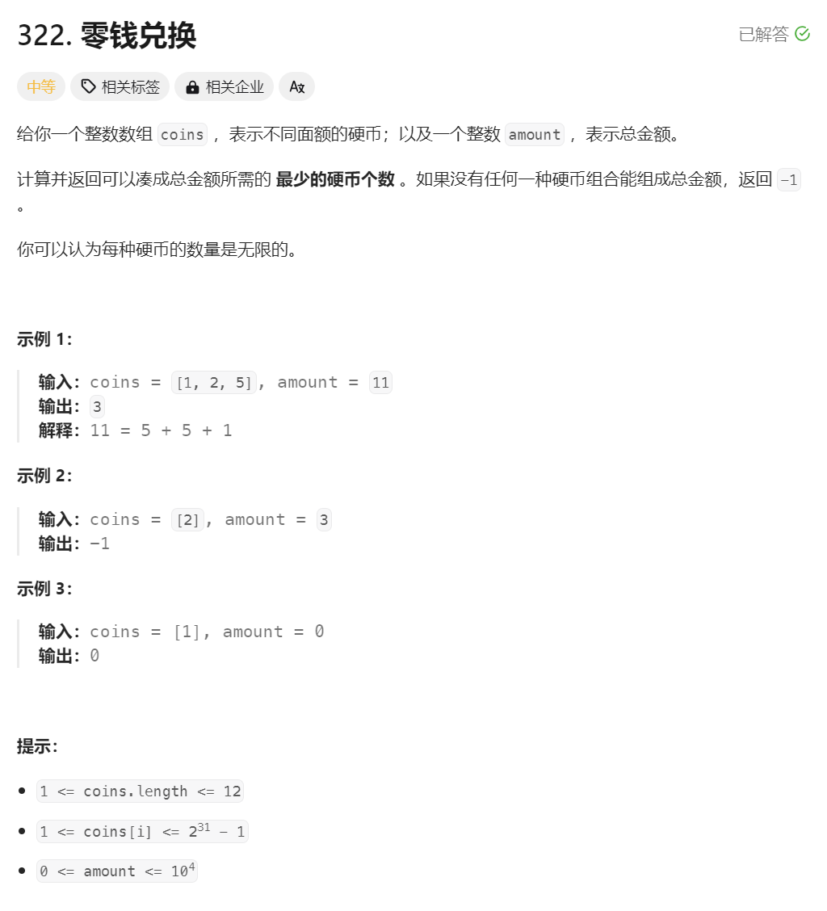

# LeetCode 322. 零钱兑换


# 题解

## 1. 确定动态转移方程
$$
dp(amount) = dp(amount - coin) + 1
$$

### 1.1 硬币很多，需要分别计算
$$
dp_i(amount) = dp(amount - coin_{i}) + 1
$$

### 1.2 取最小兑换个数
$$
dp(amount) = min(dp_0(amount - coin_{0})+1, ... dp_{n-1}(amount - coin_{n-1})+1)
$$

### 1.3 初始条件
$$
dp(0) = 0
$$
$$
dp(<0) = -1
$$

## 2. 递归解法
确定动态转移方程之后，递归总是最复合直觉的方案


```cpp
int dp(const vector<int>& coins, int amount) {
    
    // 初始条件
    if (amount == 0) {
        return 0;
    }
    if (amount < 0) {
        return -1;
    }

    // 最小兑换个数
    int min = INT_MAX;
    for (auto coin : coins) {
        // 递归到子节点
        int counter = dp(coins, amount - coin);
        if (counter >= 0 && counter < min) {
            min = counter;
        }
    }

    // 某个兑换策略下，可能无解
    if (min != INT_MAX) {
        return min + 1;
    }
    return -1;
}
```

### 2.1 递归优化
前面的递归解法在递归到子节点之后可能当前节点的值已经被其它分支已经计算过了，可以根据这点缓存已经确认的值，避免子节点重复计算
```cpp
int dp(const vector<int>& coins, int amount, vector<int>& cache) {

    // 初始条件
    if (amount == 0) {
        return 0;
    }
    if (amount < 0) {
        return -1;
    }

    // 返回缓存的中间值
    if (cache[amount - 1] != -1) {
        return cache[amount - 1];
    }

    // 最小兑换个数
    int min = INT_MAX;
    for (auto coin : coins) {
        // 递归到子节点
        int counter = dp(coins, amount - coin, cache);
        if (counter >= 0 && counter < min) {
            min = counter;
        }
    }

    if (min != INT_MAX) {
        // 缓存中间值
        cache[amount - 1] = min + 1;
        return min + 1;
    }
    return -1;
}
```

## 3. 迭代解法
递归缺陷很明显，数值很大的时候，很容易栈溢出

```cpp
int change(const vector<int>& coins, int amount) {
    // 初始条件
    if (amount < 0) return -1;

    // 缓存中间值
    vector<int> dp(amount + 1, -1);

    // 初始条件
    dp[0] = 0;

    // 迭代爬梯子
    for (int i = 1; i <= amount; i++) {
        int min = INT_MAX;
        for (int coin : coins) {
            // 计算最小兑换个数
            if (i - coin >= 0 && dp[i - coin] >= 0 && dp[i - coin] < min) {
                min = dp[i - coin];
            }
        }
        dp[i] = (min == INT_MAX) ? -1 : min + 1;
    }
    return dp[amount];
}
```

## 4. 完整代码
```cpp
#include <vector>
#include <iostream>
using namespace std;

int change(const vector<int>& coins, int amount) {
    // 初始条件
    if (amount < 0) return -1;

    // 缓存中间值
    vector<int> dp(amount + 1, -1);

    // 初始条件
    dp[0] = 0;

    // 迭代爬梯子
    for (int i = 1; i <= amount; i++) {
        int min = INT_MAX;
        for (int coin : coins) {
            // 计算最小兑换个数
            if (i - coin >= 0 && dp[i - coin] >= 0 && dp[i - coin] < min) {
                min = dp[i - coin];
            }
        }
        dp[i] = (min == INT_MAX) ? -1 : min + 1;
    }
    return dp[amount];
}

class Solution {
public:
    static int coinChange(vector<int>&& coins, int amount) {
        return change(coins, amount);
    }
};

void Test() {
    // 3
    cout << Solution::coinChange({ 1,2,5 }, 11) << endl;
    // -1
    cout << Solution::coinChange({ 2 }, 3) << endl;
    // 0
    cout << Solution::coinChange({ 1 }, 0) << endl;
    // 20 递归不优化这里会超时
    cout << Solution::coinChange({ 1,2,5 }, 100) << endl;
    // 20 递归到这里会超时
    cout << Solution::coinChange({ 186,419,83,408 }, 6249) << endl;
}
```

# 参考
[1] 322. 零钱兑换 https://leetcode.cn/problems/coin-change/description/
