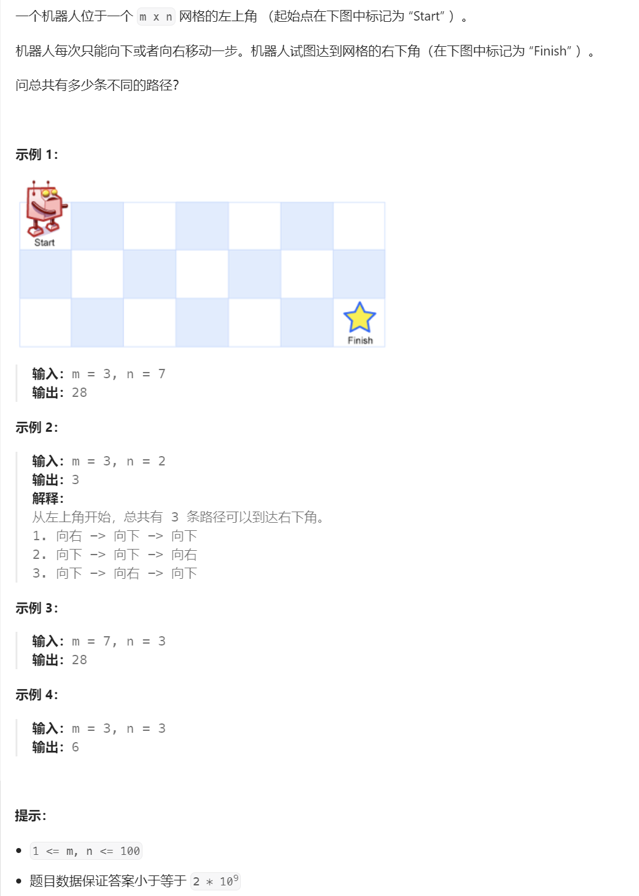

# LeetCode 62. 不同路径


# 题解
## 1. 动态规划分解，要达到位置(m,n)，最多有两种方式，一种是先达到(m-1, n)，或者(m, n-1)；然后将这两种方式加起来即可
```cpp
dp(m, n) = dp(m-1, n) + dp(m, n-1);
```

## 2. 确认终止搜索条件，当m=1或者n=1的时候，不管另一个数是多少都只有一条路径，即
```cpp
dp(m, 1) == 1;
dp(1, n) == 1;
```

## 3. 递归搜索全部路径，递归方式比较符合直觉（先理解，再优化）
```cpp
int dp(int m, int n) {
    if (m == 1 || n == 1) return 1;
    return dp(m - 1, n) + dp(m, n - 1);
}
```

## 4. 优化，当m和n都很小的时候（大概50以内）还能算，多一点就会栈溢出（你的栈要是大一点也许可以试试更大的数字），这里提供一种循环迭代的编码方式
```cpp
int dp(int m, int n) {
    vector<vector<int>> dp(m, vector<int>(n));
    for (int im = 0; im < m; im++) {
        for (int in = 0; in < n; in++) {
            // 迭代器索引从0起的，所以判定条件需要换成0
            if (im == 0 || in == 0) {
                dp[im][in] = 1;
            } else {
                dp[im][in] = dp[im-1][in] + dp[im][in-1];
            }
        }
    }
    // 迭代器索引从0起的，所以最大索引需要-1
    return dp[m-1][n-1];
}
```

## 完整代码
```cpp
class Solution {
public:
    int uniquePaths(int m, int n) {
        return DynamicProgramming(m, n);
    }

    int DynamicProgramming(int m, int n) {
        vector<vector<int>> dp(m, vector<int>(n));
        for (int im = 0; im < m; im++) {
            for (int in = 0; in < n; in++) {
                if (im == 0 || in == 0) {
                    dp[im][in] = 1;
                } else {
                    dp[im][in] = dp[im-1][in] + dp[im][in-1];
                }
            }
        }
        return dp[m-1][n-1];
    }
};

void Test() {
    // 28
    cout << Solution::uniquePaths(3, 7) << endl;
    // 3
    cout << Solution::uniquePaths(3, 2) << endl;
    // 1916797311，递归方法在这条测试下会溢出
    cout << Solution::uniquePaths(51, 9) << endl;
}
```


# 参考
[1] 动态规划 https://en.wikipedia.org/wiki/Dynamic_programming

[2] leetcode 62. 不同路径 https://leetcode.cn/problems/unique-paths/description/

