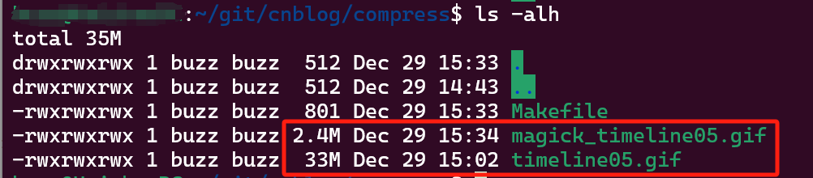

# 1. 安装ImageMagick
```
sudo apt-get update
sudo apt-get install imagemagick
```

# 2. 图片压缩基本指令
```
# -monitor 显示进度
# -fuzz 5% 颜色容差（color fuzz factor）
# -layers Optimize 对图层进行优化处理
convert -monitor timeline05.gif -fuzz 5% -layers Optimize magick_timeline05.gif
```

# 3. 利用Makefile一键全部压缩成magick_前缀的图片
```
# 定义 ImageMagick 命令和压缩质量变量
IMAGEMAGICK = convert
FUZZ = 5%

# 查找当前目录下所有未压缩的图片文件
ORIGINAL_IMAGES := $(wildcard *.png) $(wildcard *.jpg) $(wildcard *.jpeg) $(wildcard *.gif)

# 过滤出需要压缩的图片文件（不包括带有前缀 "magick_" 的图片）
TO_COMPRESS_IMAGES := $(filter-out magick_%, $(ORIGINAL_IMAGES))

# 将压缩后的图片文件名加上前缀 "magick_"
COMPRESSED_IMAGES := $(addprefix magick_, $(TO_COMPRESS_IMAGES))

# 定义压缩所有图片的规则
compress: $(COMPRESSED_IMAGES)

# 定义每个图片的压缩规则
$(COMPRESSED_IMAGES): magick_% : %
	@echo "Compressing $<..."
	$(IMAGEMAGICK) -monitor $< -fuzz $(FUZZ) -layers Optimize $@

# 定义清除所有压缩后的图片的规则
clean:
	rm -f magick_*
```

## 压缩率非常惊人



# 参考
[1] 运行环境：Windows wsl, ubuntu20.04.6

[2] imagemagick命令行参数 https://imagemagick.org/script/command-line-options.php